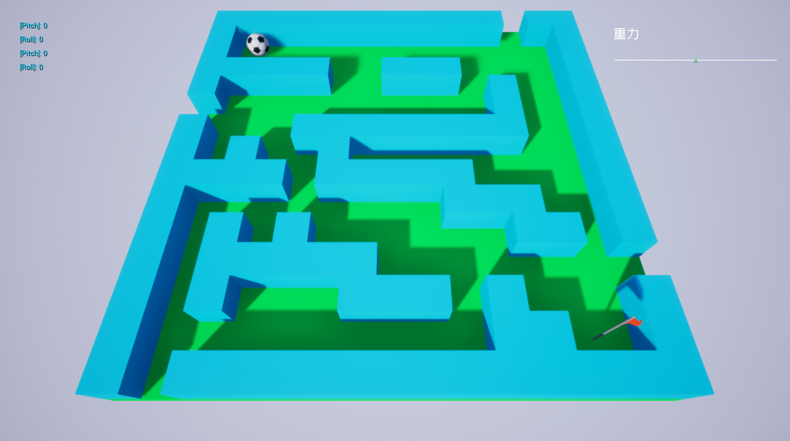

## プロジェクト

ボールを転がしてゴールまで持っていくゲーム

## 必須要件

Unreal Engine 4.27.1

## ビルド方法

1. [`https://github.com/hotwatermorning/RollingBall.git`](https://github.com/hotwatermorning/RollingBall.git) を clone する
2. RollingBall.uproject をダブルクリックで開く
    1. このとき、 RollingBall モジュールが見つからないのでリビルドするかどうか確認するメッセージが表示されるので、リビルドする
    2. エディター起動後、メッセージログに NewLevel_BuildData ファイルがロードに失敗したというエラーが出るが無視する。
3. ビルドのドロップダウンメニューから、「リフレクションキャプチャをビルド」を実行する。
4. プレイボタンでゲームを開始する。

## 操作方法

1. ゲーム起動後、ビューポートを一度クリックする
2. W,A,S,D または ゲームパッドの左十字キーで盤面を傾けられる
3. ボールを右下の旗の位置に持っていくとクリアになる。

## 機能

- ボールが盤面から飛び出すとゲームがリスタートする
- キーボードの R キーで強制的にリスタートする
- 左上のスライダーで重力を制御できる（これによってボールの転がりやすさが変わる）
